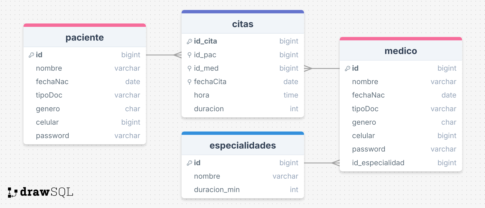

# Módulo de gestión de citas médicas en ASP.NET

Pequeño módulo de gestión de citas

## Tecnologías usadas
- .NET framework
- ASP.NET
- Bootstrap
- Knockout.js
- Postgres (base de datos)


## Backend

### Base de datos (Postgres)



### API

##### Usuarios

```http
/api/Usuarios
```

| Función | HTTP     |  Ruta |  Entrada |Descripción                |
| :----- | :------- | :------- | :--------------- |:------------------------- |
| `RegistrarUsuario` | `POST` | |Id, Nombre, FechaNac ("YYYY-MM-DD"), TipoDoc (cc/ti/ce/rc/pa), Genero(m/f/o), celular, Password, TipoUsuario(paciente/medico), IdEspecialidad (solo si es médico)|Registro (sirve para ambos tipos de usuarios) ||
| `Login` | `POST` |/Login |Id, Password, TipoUsuario (paciente/medico)|Inicio de sesión (sirve para ambos tipos de usuarios), devuelve objeto usuario |
| `ObtenerUsuarioPorId` | `GET` | /{id}|(Query) ?tipo={paciente/medico}|Obtener usuario por id |
| `ObtenerNombrePorId` | `GET` | /{id}/nombre|(Query) ?tipo={paciente/medico}|Obtener nombre de usuario por id |
| `ObtenerMedicosPorEspecialidad` | `GET` | /{NombreEspecialidad}|NombreEspecialidad|Obtener lista de médicos por especialidad |
| `ObtenerEspecialidades` | `GET` |/especialidades ||Obtener todas las especialidades |


##### Citas

```http
  /api/Citas
```

| Función | HTTP     |  Ruta |  Entrada |Descripción                |
| :----- | :------- | :------- | :--------------- |:------------------------- |
| `ObtenerDisponibilidad`| `GET` | /disponibilidad|(Query) ?idMedico={idmedico}&fecha=YYYY-MM-DD|Ver horarios disponibles para agendar cita |
| `agendar`| `POST` | |IdPac, IdMed, FechaCita("YYYY-MM-DD"), Hora("HH-mm")|Agendar una cita |
| `ObtenerCitas`| `GET` | |(Query?) ?fechaDesde=YYYY-MM-DD&fechaHasta=YYYY-MM-DD|Obtener citas, usar query para filtrar por fechas |
| `ObtenerCitasPorPaciente`| `GET` | /paciente/{idPaciente}|IdPaciente|Obtener citas asociadas a un paciente |
| `DeleteCita`      | `DELETE` | /{id_cita}|IdCita|Eliminar una cita |


